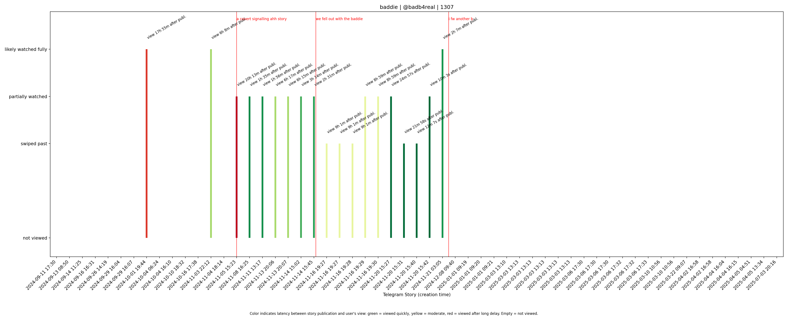

# Profiling Telegram Stories Viewers

A script for profiling the viewers of your Telegram stories. It walks through all your published and highlighted (but not archived, unfortunately) stories, and records the viewers into .csv files.

It uses Telethon library to fetch the data. To use the script, you need to put API keys of your Telegram app into .env. You will also be prompted to log into your Telegram account so that the script can fetch the stories.

## Usage

```bash
pip3 install matplotlib telethon python-dotenv
python3 main.py
```

## Visualization

Using the .csv files, you can visualize the views of a certain viewer of your stories.

```bash
python visualize.py <folder> <viewer_user_id>
```

When you run the visualizer it assigns an *engagement score* to every story of the selected viewer.  For each story pair we measure the time gap Δt between a user’s view of story *n* and their view of story *n+1*.  Gathering these gaps for **all** viewers gives a distribution that we summarise with the 20-th and 80-th percentiles:

* **p20** — a "quick swipe" threshold (users who almost immediately move to the next story)
* **p80** — a "slow swipe" threshold (users who linger long enough that they most likely watched the story in full)

For the target viewer the algorithm compares their individual Δt with these global thresholds:

* Δt ≤ p20 → **swiped past** (engagement = 0.5)
* p20 < Δt < p80 → **partially watched** (engagement = 0.75)
* Δt ≥ p80 **or** the next story was never viewed → **watched fully** (engagement = 1)

A story that the viewer never opened receives an engagement of 0.  This data-driven approach adapts to the natural viewing speed distribution in your dataset and surfaces relative engagement levels in the resulting plot, where bar height encodes engagement and bar colour encodes the latency between story publication and view.

### Example

